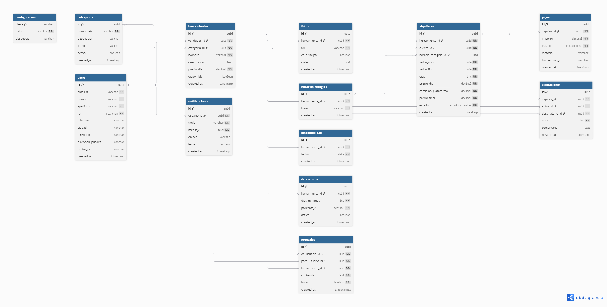

# 🔧 eitool — Alquila tu herramienta

Plataforma web P2P para el alquiler de herramientas entre particulares. Cualquier usuario registrado puede publicar sus herramientas en alquiler **y** alquilar las de otros. La plataforma actúa como intermediaria aplicando una comisión configurable sobre cada transacción.

🌐 **Producción:** [proyecto-final-daw-alquila-tu-herra.vercel.app](https://proyecto-final-daw-alquila-tu-herra.vercel.app)

---

## 🚀 Tech Stack

| Capa           | Tecnología                           |
| -------------- | ------------------------------------ |
| Frontend       | Next.js 16 (App Router) + React 19   |
| Lenguaje       | TypeScript                           |
| Estilos        | Tailwind CSS v4                      |
| Backend / API  | Next.js API Routes (REST)            |
| Base de datos  | Supabase (PostgreSQL)                |
| Autenticación  | Supabase Auth (email + confirmación) |
| Almacenamiento | Supabase Storage                     |
| Tiempo real    | Supabase Realtime                    |
| Pagos          | Stripe (Checkout + Webhooks)         |
| Deploy         | Vercel                               |
| Testing        | Vitest + Playwright + k6             |

---

## ✨ Funcionalidades

### Páginas informativas

- `/sobre-nosotros` — descripción del proyecto y valores
- `/contacto` — formulario de contacto
- `/terminos` — términos y condiciones de uso
- `/privacidad` — política de privacidad (RGPD)

### Usuario

- Registro con confirmación de email
- Perfil con foto, teléfono, ciudad, dirección privada y pública (zona aproximada visible para otros)
- Banner para completar perfil antes de publicar herramientas

### Herramientas

- Publicación de herramientas con fotos, categoría, precio por día, descripción y horarios de recogida
- Foto principal obligatoria + fotos adicionales
- Gestión de disponibilidad por fechas (calendario)
- Descuentos automáticos por tramos de días (ej. -10% a partir de 7 días)
- Activar/desactivar herramientas sin eliminarlas

### Alquileres

- Catálogo público con filtros por categoría, ciudad, precio y búsqueda por texto
- Proceso de reserva con selección de fechas y horario de recogida
- Estados: pendiente → confirmado → activo → finalizado / cancelado
- Pagos reales con Stripe Checkout
- Cálculo automático de precio con descuentos y comisión de plataforma

### Mensajería

- Chat en tiempo real entre usuario y propietario de la herramienta
- Panel flotante accesible desde cualquier página
- Badge de mensajes no leídos
- Notificaciones automáticas al recibir un mensaje

### Notificaciones

- Sistema de notificaciones internas en tiempo real
- Alertas para: nueva solicitud, alquiler confirmado/rechazado, nuevo mensaje, pago completado

### Valoraciones

- Valoración mutua entre cliente y propietario al finalizar el alquiler
- Puntuación y comentario

### Panel de administración (`/admin`)

- Dashboard con estadísticas y gráficos
- Gestión de usuarios, herramientas, alquileres, pagos y valoraciones
- Gestión de categorías con iconos
- Moderación de conversaciones de chat (solo lectura)
- Configuración de comisión de plataforma

---

## 🗄️ Modelo de datos



### Tablas principales

- `users` — perfil de usuario (extiende `auth.users` de Supabase)
- `herramientas` — herramientas publicadas
- `fotos` — fotos de herramientas (Storage)
- `categorias` — categorías de herramientas
- `horarios_recogida` — horarios disponibles por herramienta
- `alquileres` — reservas con estado y precio final
- `disponibilidad` — fechas bloqueadas por herramienta
- `descuentos` — descuentos por tramos de días
- `pagos` — registro de pagos procesados por Stripe
- `valoraciones` — valoraciones entre usuarios
- `notificaciones` — notificaciones internas
- `mensajes` — mensajes del chat entre usuarios
- `plataforma_config` — configuración global (ej. comisión)

---

## 📐 Arquitectura

Arquitectura **monolítica con separación de responsabilidades**:

- El **frontend** (React/Next.js) solo se comunica con la API REST propia
- La **lógica de negocio** vive exclusivamente en los API Routes — nunca en el cliente ni directamente en Supabase
- **Supabase RLS** protege los datos a nivel de base de datos como segunda capa de seguridad
- La API es consumible desde cualquier cliente externo (futura app móvil en Phase 2)
- Los errores de servidor nunca se exponen al cliente — mensajes genéricos en español con logging en servidor

---

## 📁 Estructura del proyecto

```
/
├── docs/
│   ├── database.sql          # Esquema completo de la BD
│   ├── seeds.sql             # Datos de ejemplo
│   └── diagrama-bbdd.png     # Diagrama entidad-relación
└── web/
    ├── src/
    │   ├── app/
    │   │   ├── (auth)/       # Login y registro
    │   │   ├── (main)/       # Páginas públicas y de usuario
    │   │   │   ├── (cuenta)/ # Perfil, mis herramientas, alquileres, etc.
    │   │   │   ├── herramientas/
    │   │   │   ├── pago/     # Páginas de retorno de Stripe
    │   │   │   └── ...
    │   │   ├── admin/        # Panel de administración
    │   │   └── api/          # Endpoints REST
    │   ├── components/       # Componentes reutilizables
    │   ├── lib/              # Supabase, Stripe, utilidades
    │   └── proxy.ts          # Middleware de protección de rutas
    └── tests/
        ├── integration/      # Tests de integración (Vitest)
        ├── security/         # Tests de seguridad (IDOR, inyecciones, PII)
        ├── e2e/              # Tests end-to-end (Playwright)
        └── performance/      # Tests de carga (k6)
```

---

## 🔌 API Endpoints

### Público

| Método | Endpoint                 | Descripción                       |
| ------ | ------------------------ | --------------------------------- |
| GET    | `/api/herramientas`      | Catálogo con filtros y paginación |
| GET    | `/api/herramientas/[id]` | Detalle de herramienta            |
| GET    | `/api/categorias`        | Lista de categorías               |
| GET    | `/api/ciudades`          | Lista de ciudades disponibles     |

### Autenticado

| Método | Endpoint                         | Descripción                    |
| ------ | -------------------------------- | ------------------------------ |
| POST   | `/api/alquileres`                | Crear solicitud de alquiler    |
| GET    | `/api/alquileres/mis-alquileres` | Alquileres como cliente        |
| GET    | `/api/alquileres/recibidos`      | Alquileres como propietario    |
| PATCH  | `/api/alquileres/recibidos`      | Confirmar o rechazar solicitud |
| POST   | `/api/pagos/checkout`            | Crear sesión de pago en Stripe |
| GET    | `/api/mensajes`                  | Cargar conversación            |
| POST   | `/api/mensajes`                  | Enviar mensaje                 |
| GET    | `/api/mensajes/conversaciones`   | Lista de conversaciones        |
| PATCH  | `/api/mensajes/leidos`           | Marcar mensajes como leídos    |
| POST   | `/api/valoraciones`              | Crear valoración               |
| GET    | `/api/notificaciones`            | Notificaciones del usuario     |

### Admin

| Método | Endpoint                  | Descripción            |
| ------ | ------------------------- | ---------------------- |
| GET    | `/api/admin/usuarios`     | Lista de usuarios      |
| GET    | `/api/admin/herramientas` | Lista de herramientas  |
| GET    | `/api/admin/alquileres`   | Lista de alquileres    |
| GET    | `/api/admin/pagos`        | Lista de pagos         |
| GET    | `/api/admin/mensajes`     | Moderación de mensajes |
| GET    | `/api/admin/stats`        | Estadísticas generales |
| GET    | `/api/admin/graficos`     | Datos para gráficos    |

---

## ⚙️ Instalación en local

### Requisitos

- Node.js 18+
- Cuenta de Supabase
- Cuenta de Stripe

### Pasos

```bash
# Clonar el repositorio
git clone https://github.com/edgarbdn/Proyecto-final-DAW--Alquila-tu-herramienta.git
cd Proyecto-final-DAW--Alquila-tu-herramienta/web

# Instalar dependencias
npm install

# Configurar variables de entorno
cp .env.test.example .env.local
# Edita .env.local con tus credenciales

# Ejecutar en desarrollo
npm run dev
```

Abre [http://localhost:3000](http://localhost:3000).

---

## 📋 Variables de entorno

Crea un archivo `.env.local` en `/web` con las siguientes variables:

```env
# Supabase
NEXT_PUBLIC_SUPABASE_URL=https://tu-proyecto.supabase.co
NEXT_PUBLIC_SUPABASE_ANON_KEY=tu-anon-key
SUPABASE_SERVICE_ROLE_KEY=tu-service-role-key

# Stripe
STRIPE_SECRET_KEY=sk_live_...
STRIPE_WEBHOOK_SECRET=whsec_...

# URL pública de la app (para Stripe callbacks)
NEXT_PUBLIC_URL=http://localhost:3000
```

---

## 🧪 Testing

```bash
# Tests de integración y seguridad (Vitest)
npm test

# Tests E2E (Playwright)
npm run test:e2e

# Tests de rendimiento (k6)
k6 run tests/performance/load.js
```

### Configurar usuarios de prueba

```bash
# Crear usuarios de test
npm run test:setup

# Eliminar usuarios de test
npm run test:cleanup
```

### Resultados

| Suite                | Tests               | Resultado      |
| -------------------- | ------------------- | -------------- |
| Integración (Vitest) | 105                 | ✅ Todos pasan |
| Seguridad (Vitest)   | incluidos arriba    | ✅ Todos pasan |
| E2E (Playwright)     | 26                  | ✅ Todos pasan |
| Rendimiento (k6)     | 20 VUs, p95 < 285ms | ✅ 0% errores  |

---

## 🔒 Seguridad

- **RLS (Row Level Security)** en todas las tablas de Supabase
- **Validación** en cliente y servidor en todos los formularios
- **Errores genéricos** al cliente — los errores reales se loguean solo en servidor
- **Middleware de rutas** protege todas las rutas privadas
- **Webhook de Stripe** verificado con firma HMAC

---

## 📅 Rama de trabajo

| Rama      | Propósito                            |
| --------- | ------------------------------------ |
| `main`    | Producción (desplegada en Vercel)    |
| `develop` | Integración de features              |
| `feat/*`  | Desarrollo de nuevas funcionalidades |

---

## 👤 Autor

**Edgar** — Proyecto Final de Grado Superior DAW (Desarrollo de Aplicaciones Web)

---

## 🗺️ Roadmap (Phase 2)

### Funcionalidades de alquiler

- [ ] Confirmación del alquiler opcional o automática según preferencia del propietario
- [ ] Tiempo máximo de confirmación por parte del propietario
- [ ] Retención de fianza al iniciar el alquiler
- [ ] Aceptación de ambas partes en la recogida y en la devolución
- [ ] El cliente ve el desglose completo del descuento aplicado en el proceso de reserva
- [ ] El usuario puede ver sus ganancias totales y mensuales como propietario

### Comunicación

- [ ] Emails transaccionales para notificaciones nuevas y mensajes de chat (Resend)
- [ ] Formulario de contacto funcional con envío real de email
- [ ] Implementar chatbot de IA para soporte al usuario

### Crecimiento y visibilidad

- [ ] SEO — metadatos dinámicos, sitemap, structured data
- [ ] Integración con redes sociales (compartir herramientas, login social)
- [ ] Sistema de publicidad (Adds)
- [ ] Geolocalización de herramientas en mapa

### Plataforma

- [ ] App móvil con React Native + Expo consumiendo la misma API
- [ ] Sistema de filtros de contenido en el chat interno entre clientes (teléfonos, emails)
