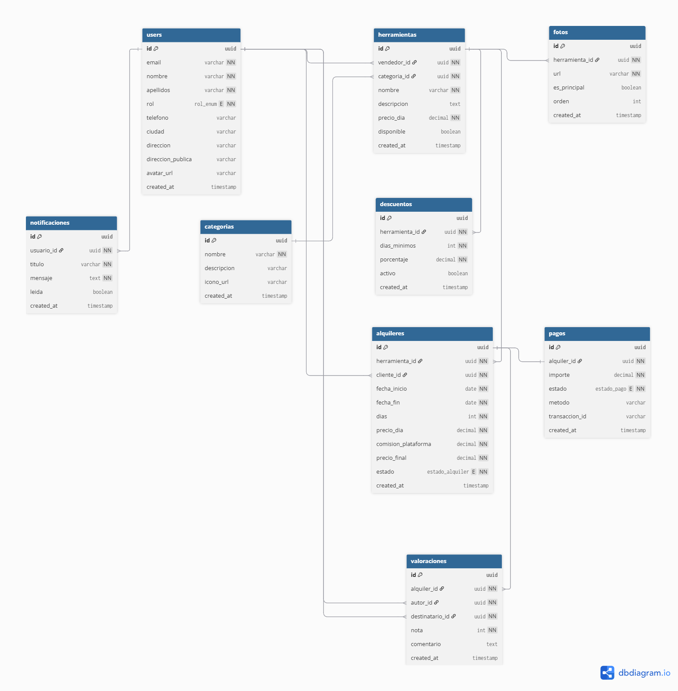

# 🔧 Alquila tu Herramienta

Plataforma web para el alquiler de herramientas entre particulares. Los usuarios pueden registrarse como **vendedor** para publicar sus herramientas en alquiler, o como **cliente** para alquilar herramientas de otros usuarios.

La plataforma actúa como intermediaria, aplicando una comisión automática sobre cada alquiler.

---

## 🚀 Tech Stack

| Capa           | Tecnología                      |
| -------------- | ------------------------------- |
| Frontend       | Next.js 14 (App Router) + React |
| Backend / API  | Next.js API Routes              |
| Base de datos  | Supabase (PostgreSQL)           |
| Autenticación  | Supabase Auth                   |
| Almacenamiento | Supabase Storage                |
| Pagos          | Stripe                          |
| Deploy         | Vercel + Supabase Cloud         |

---

## 📐 Arquitectura

El proyecto sigue una arquitectura **monolítica con separación de responsabilidades**:

- El **frontend** está construido con Next.js y React
- La **lógica de negocio** (cálculo de precios, comisiones, disponibilidad) vive en las API Routes de Next.js, nunca en el cliente
- **Supabase** gestiona la base de datos, autenticación y almacenamiento de archivos
- La API es consumible desde cualquier cliente externo (futura app móvil)

---

## 🗄️ Modelo de datos



---

## ✨ Funcionalidades principales

- Registro con roles: cliente, vendedor y admin (cambiado a user/admin)
- Publicación de herramientas con fotos, categoría, precio y descripción
- Sistema de disponibilidad por fechas
- Descuentos automáticos por tramos de días
- Reservas con gestión de estados (pendiente, confirmado, activo, finalizado, cancelado)
- Pagos reales integrados con Stripe
- Valoraciones mutuas entre cliente y vendedor
- Panel de administración
- Sistema de notificaciones internas

---

## 📁 Estructura del proyecto

```
/
├── app/                  # Páginas y API Routes (Next.js App Router)
│   ├── api/              # Endpoints de la API
│   └── (routes)/         # Páginas de la aplicación
├── components/           # Componentes reutilizables
├── lib/                  # Utilidades y configuración de Supabase
├── docs/                 # Documentación y diagramas
└── public/               # Archivos estáticos
```

---

## ⚙️ Instalación y configuración

> Próximamente una vez configurado el proyecto Next.js

---

## 📋 Variables de entorno

> Próximamente una vez configurado el proyecto Next.js

---

## 📅 Planificación

El proyecto está organizado en 5 sprints de 10 días en [GitHub Projects](../../projects).

| Sprint   | Contenido                        |
| -------- | -------------------------------- |
| Sprint 1 | Setup y autenticación            |
| Sprint 2 | Herramientas y categorías        |
| Sprint 3 | Alquileres y disponibilidad      |
| Sprint 4 | Pagos, descuentos y valoraciones |
| Sprint 5 | Dashboard admin y pulido final   |

---

## 👤 Autor

Edgar — Proyecto Final de Grado Superior DAW..
